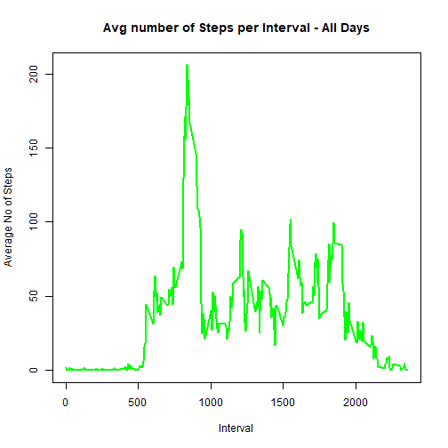

* Dataset: [Activity monitoring data](https://d396qusza40orc.cloudfront.net/repdata%2Fdata%2Factivity.zip)


## 1. Loading and preprocessing the data


```r
setwd("~/GitHub/RepData_PeerAssessment1")
activity <- read.csv("activity.csv")
summary(activity)
```

```
##      steps                date          interval     
##  Min.   :  0.00   2012-10-01:  288   Min.   :   0.0  
##  1st Qu.:  0.00   2012-10-02:  288   1st Qu.: 588.8  
##  Median :  0.00   2012-10-03:  288   Median :1177.5  
##  Mean   : 37.38   2012-10-04:  288   Mean   :1177.5  
##  3rd Qu.: 12.00   2012-10-05:  288   3rd Qu.:1766.2  
##  Max.   :806.00   2012-10-06:  288   Max.   :2355.0  
##  NA's   :2304     (Other)   :15840
```

```r
str(activity)
```

```
## 'data.frame':	17568 obs. of  3 variables:
##  $ steps   : int  NA NA NA NA NA NA NA NA NA NA ...
##  $ date    : Factor w/ 61 levels "2012-10-01","2012-10-02",..: 1 1 1 1 1 1 1 1 1 1 ...
##  $ interval: int  0 5 10 15 20 25 30 35 40 45 ...
```

```r
# Turn the date data into a valid date class to allows for easier processing : Dates are in YYYY-MM-DD format
dates <- strptime(activity$date, "%Y-%m-%d")
activity$date <- dates

# Keep a list of all possible days
uniqueDates <- unique(dates)

# Keep a list of all possible intervals
uniqueIntervals <- unique(activity$interval)
```


## 2. What is mean total number of steps taken per day?
### 2.1 Total number of steps per day


```r
stepsSplit <- split(activity$steps, dates$yday)
sum_by_date <- sapply(stepsSplit, sum, na.rm=TRUE)
sum_by_date
```

```
##   274   275   276   277   278   279   280   281   282   283   284   285 
##     0   126 11352 12116 13294 15420 11015     0 12811  9900 10304 17382 
##   286   287   288   289   290   291   292   293   294   295   296   297 
## 12426 15098 10139 15084 13452 10056 11829 10395  8821 13460  8918  8355 
##   298   299   300   301   302   303   304   305   306   307   308   309 
##  2492  6778 10119 11458  5018  9819 15414     0 10600 10571     0 10439 
##   310   311   312   313   314   315   316   317   318   319   320   321 
##  8334 12883  3219     0     0 12608 10765  7336     0    41  5441 14339 
##   322   323   324   325   326   327   328   329   330   331   332   333 
## 15110  8841  4472 12787 20427 21194 14478 11834 11162 13646 10183  7047 
##   334 
##     0
```
### 2.2 Histogram


```r
plot(uniqueDates, sum_by_date, main="Histogram of Total Steps per day", xlab="Days in October to November 2012", ylab="Frequency", type="h", lwd=4, col=blues9)
```


### 2.3 Mean of total number of steps taken per day


```r
mean_by_date <- sapply(stepsSplit, mean, na.rm=TRUE)
mean_df <- data.frame(date=uniqueDates, mean_by_date=mean_by_date, row.names=NULL)
mean_df
```

```
##          date mean_by_date
## 1  2012-10-01          NaN
## 2  2012-10-02    0.4375000
## 3  2012-10-03   39.4166667
## 4  2012-10-04   42.0694444
## 5  2012-10-05   46.1597222
## 6  2012-10-06   53.5416667
## 7  2012-10-07   38.2465278
## 8  2012-10-08          NaN
## 9  2012-10-09   44.4826389
## 10 2012-10-10   34.3750000
## 11 2012-10-11   35.7777778
## 12 2012-10-12   60.3541667
## 13 2012-10-13   43.1458333
## 14 2012-10-14   52.4236111
## 15 2012-10-15   35.2048611
## 16 2012-10-16   52.3750000
## 17 2012-10-17   46.7083333
## 18 2012-10-18   34.9166667
## 19 2012-10-19   41.0729167
## 20 2012-10-20   36.0937500
## 21 2012-10-21   30.6284722
## 22 2012-10-22   46.7361111
## 23 2012-10-23   30.9652778
## 24 2012-10-24   29.0104167
## 25 2012-10-25    8.6527778
## 26 2012-10-26   23.5347222
## 27 2012-10-27   35.1354167
## 28 2012-10-28   39.7847222
## 29 2012-10-29   17.4236111
## 30 2012-10-30   34.0937500
## 31 2012-10-31   53.5208333
## 32 2012-11-01          NaN
## 33 2012-11-02   36.8055556
## 34 2012-11-03   36.7048611
## 35 2012-11-04          NaN
## 36 2012-11-05   36.2465278
## 37 2012-11-06   28.9375000
## 38 2012-11-07   44.7326389
## 39 2012-11-08   11.1770833
## 40 2012-11-09          NaN
## 41 2012-11-10          NaN
## 42 2012-11-11   43.7777778
## 43 2012-11-12   37.3784722
## 44 2012-11-13   25.4722222
## 45 2012-11-14          NaN
## 46 2012-11-15    0.1423611
## 47 2012-11-16   18.8923611
## 48 2012-11-17   49.7881944
## 49 2012-11-18   52.4652778
## 50 2012-11-19   30.6979167
## 51 2012-11-20   15.5277778
## 52 2012-11-21   44.3993056
## 53 2012-11-22   70.9270833
## 54 2012-11-23   73.5902778
## 55 2012-11-24   50.2708333
## 56 2012-11-25   41.0902778
## 57 2012-11-26   38.7569444
## 58 2012-11-27   47.3819444
## 59 2012-11-28   35.3576389
## 60 2012-11-29   24.4687500
## 61 2012-11-30          NaN
```

### 2.4 Median of total number of steps per day

```r
median_by_date <- sapply(stepsSplit, median, na.rm=TRUE)
median_df <- data.frame(date=uniqueDates, median_by_date=median_by_date, row.names=NULL)
median_df
```

```
##          date median_by_date
## 1  2012-10-01             NA
## 2  2012-10-02              0
## 3  2012-10-03              0
## 4  2012-10-04              0
## 5  2012-10-05              0
## 6  2012-10-06              0
## 7  2012-10-07              0
## 8  2012-10-08             NA
## 9  2012-10-09              0
## 10 2012-10-10              0
## 11 2012-10-11              0
## 12 2012-10-12              0
## 13 2012-10-13              0
## 14 2012-10-14              0
## 15 2012-10-15              0
## 16 2012-10-16              0
## 17 2012-10-17              0
## 18 2012-10-18              0
## 19 2012-10-19              0
## 20 2012-10-20              0
## 21 2012-10-21              0
## 22 2012-10-22              0
## 23 2012-10-23              0
## 24 2012-10-24              0
## 25 2012-10-25              0
## 26 2012-10-26              0
## 27 2012-10-27              0
## 28 2012-10-28              0
## 29 2012-10-29              0
## 30 2012-10-30              0
## 31 2012-10-31              0
## 32 2012-11-01             NA
## 33 2012-11-02              0
## 34 2012-11-03              0
## 35 2012-11-04             NA
## 36 2012-11-05              0
## 37 2012-11-06              0
## 38 2012-11-07              0
## 39 2012-11-08              0
## 40 2012-11-09             NA
## 41 2012-11-10             NA
## 42 2012-11-11              0
## 43 2012-11-12              0
## 44 2012-11-13              0
## 45 2012-11-14             NA
## 46 2012-11-15              0
## 47 2012-11-16              0
## 48 2012-11-17              0
## 49 2012-11-18              0
## 50 2012-11-19              0
## 51 2012-11-20              0
## 52 2012-11-21              0
## 53 2012-11-22              0
## 54 2012-11-23              0
## 55 2012-11-24              0
## 56 2012-11-25              0
## 57 2012-11-26              0
## 58 2012-11-27              0
## 59 2012-11-28              0
## 60 2012-11-29              0
## 61 2012-11-30             NA
```


## 3. What is the average daily activity pattern?

### 3.1 Make a time series plot


```r
intervals <- split(activity$steps, activity$interval)
avg_Interval <- sapply(intervals, mean, na.rm=TRUE)

plot(uniqueIntervals, avg_Interval, type="l",main="Avg number of Steps per Interval - All Days", xlab="Interval",    ylab="Average No of Steps", lwd=2, col="green")
```



### 3.2 Interval with most steps


```r
maxIntervalDays <- max(avg_Interval, na.rm=TRUE)
maxIndex <- as.numeric(which(avg_Interval == maxIntervalDays))
maxInterval <- uniqueIntervals[maxIndex]
maxInterval
```

```
## [1] 835
```


## 4. Imputing missing values

###4.1 Calculate and report the total number of missing values in the dataset


```r
nulls <- is.na(activity$steps)
sum(nulls)
```

```
## [1] 2304
```

### 4.2 Fill in missing values


```r
mean_by_date[is.nan(mean_by_date)] <- 0
summary(mean_by_date)
```

```
##    Min. 1st Qu.  Median    Mean 3rd Qu.    Max. 
##    0.00   23.53   36.09   32.48   44.48   73.59
```

```r
meancolumn <- rep(mean_by_date, 288)

Steps <- activity$steps
null_steps <- is.na(Steps)
summary (null_steps)
```

```
##    Mode   FALSE    TRUE 
## logical   15264    2304
```

```r
Steps[null_steps] <- meancolumn[null_steps]
```

### 4.3 Create a new dataset


```r
activity2 <- activity
summary(activity2)
```

```
##      steps             date                        interval     
##  Min.   :  0.00   Min.   :2012-10-01 00:00:00   Min.   :   0.0  
##  1st Qu.:  0.00   1st Qu.:2012-10-16 00:00:00   1st Qu.: 588.8  
##  Median :  0.00   Median :2012-10-31 00:00:00   Median :1177.5  
##  Mean   : 37.38   Mean   :2012-10-30 23:32:27   Mean   :1177.5  
##  3rd Qu.: 12.00   3rd Qu.:2012-11-15 00:00:00   3rd Qu.:1766.2  
##  Max.   :806.00   Max.   :2012-11-30 00:00:00   Max.   :2355.0  
##  NA's   :2304
```

```r
activity2$steps <- Steps
summary(activity2)
```

```
##      steps             date                        interval     
##  Min.   :  0.00   Min.   :2012-10-01 00:00:00   Min.   :   0.0  
##  1st Qu.:  0.00   1st Qu.:2012-10-16 00:00:00   1st Qu.: 588.8  
##  Median :  0.00   Median :2012-10-31 00:00:00   Median :1177.5  
##  Mean   : 36.73   Mean   :2012-10-30 23:32:27   Mean   :1177.5  
##  3rd Qu.: 31.00   3rd Qu.:2012-11-15 00:00:00   3rd Qu.:1766.2  
##  Max.   :806.00   Max.   :2012-11-30 00:00:00   Max.   :2355.0
```

### 4.4 Make a histogram of the total number of steps taken each day  

```r
stepsSplit2 <- split(activity2$steps, dates$yday)
 stepsSplit2 <- split(activity2$steps, dates$yday)
sum_by_date2 <- sapply(stepsSplit2, sum)
sum_by_date2
```

```
##       274       275       276       277       278       279       280 
##  9312.632   126.000 11352.000 12116.000 13294.000 15420.000 11015.000 
##       281       282       283       284       285       286       287 
##  9291.812 12811.000  9900.000 10304.000 17382.000 12426.000 15098.000 
##       288       289       290       291       292       293       294 
## 10139.000 15084.000 13452.000 10056.000 11829.000 10395.000  8821.000 
##       295       296       297       298       299       300       301 
## 13460.000  8918.000  8355.000  2492.000  6778.000 10119.000 11458.000 
##       302       303       304       305       306       307       308 
##  5018.000  9819.000 15414.000  9220.306 10600.000 10571.000  9345.736 
##       309       310       311       312       313       314       315 
## 10439.000  8334.000 12883.000  3219.000  9304.674  9466.753 12608.000 
##       316       317       318       319       320       321       322 
## 10765.000  7336.000  9500.118    41.000  5441.000 14339.000 15110.000 
##       323       324       325       326       327       328       329 
##  8841.000  4472.000 12787.000 20427.000 21194.000 14478.000 11834.000 
##       330       331       332       333       334 
## 11162.000 13646.000 10183.000  7047.000  9281.670
```

```r
plot(uniqueDates, sum_by_date2, main="Histogram of Total Steps per day(After Imputing)", xlab="Days in October to November 2012", ylab="Frequency", type="h", lwd=4, col=blues9)
```


### 4.5 Calculate and report the mean and median total number of steps taken per day. 

#### 4.5.1 Mean recalculated


```r
mean_by_date2 <- sapply(stepsSplit2, mean)
mean_df2 <- data.frame(date=uniqueDates, mean_by_date = mean_by_date,mean_by_date2 = mean_by_date2 , row.names=NULL)
mean_df2
```

```
##          date mean_by_date mean_by_date2
## 1  2012-10-01    0.0000000    32.3355276
## 2  2012-10-02    0.4375000     0.4375000
## 3  2012-10-03   39.4166667    39.4166667
## 4  2012-10-04   42.0694444    42.0694444
## 5  2012-10-05   46.1597222    46.1597222
## 6  2012-10-06   53.5416667    53.5416667
## 7  2012-10-07   38.2465278    38.2465278
## 8  2012-10-08    0.0000000    32.2632378
## 9  2012-10-09   44.4826389    44.4826389
## 10 2012-10-10   34.3750000    34.3750000
## 11 2012-10-11   35.7777778    35.7777778
## 12 2012-10-12   60.3541667    60.3541667
## 13 2012-10-13   43.1458333    43.1458333
## 14 2012-10-14   52.4236111    52.4236111
## 15 2012-10-15   35.2048611    35.2048611
## 16 2012-10-16   52.3750000    52.3750000
## 17 2012-10-17   46.7083333    46.7083333
## 18 2012-10-18   34.9166667    34.9166667
## 19 2012-10-19   41.0729167    41.0729167
## 20 2012-10-20   36.0937500    36.0937500
## 21 2012-10-21   30.6284722    30.6284722
## 22 2012-10-22   46.7361111    46.7361111
## 23 2012-10-23   30.9652778    30.9652778
## 24 2012-10-24   29.0104167    29.0104167
## 25 2012-10-25    8.6527778     8.6527778
## 26 2012-10-26   23.5347222    23.5347222
## 27 2012-10-27   35.1354167    35.1354167
## 28 2012-10-28   39.7847222    39.7847222
## 29 2012-10-29   17.4236111    17.4236111
## 30 2012-10-30   34.0937500    34.0937500
## 31 2012-10-31   53.5208333    53.5208333
## 32 2012-11-01    0.0000000    32.0149498
## 33 2012-11-02   36.8055556    36.8055556
## 34 2012-11-03   36.7048611    36.7048611
## 35 2012-11-04    0.0000000    32.4504726
## 36 2012-11-05   36.2465278    36.2465278
## 37 2012-11-06   28.9375000    28.9375000
## 38 2012-11-07   44.7326389    44.7326389
## 39 2012-11-08   11.1770833    11.1770833
## 40 2012-11-09    0.0000000    32.3078945
## 41 2012-11-10    0.0000000    32.8706718
## 42 2012-11-11   43.7777778    43.7777778
## 43 2012-11-12   37.3784722    37.3784722
## 44 2012-11-13   25.4722222    25.4722222
## 45 2012-11-14    0.0000000    32.9865210
## 46 2012-11-15    0.1423611     0.1423611
## 47 2012-11-16   18.8923611    18.8923611
## 48 2012-11-17   49.7881944    49.7881944
## 49 2012-11-18   52.4652778    52.4652778
## 50 2012-11-19   30.6979167    30.6979167
## 51 2012-11-20   15.5277778    15.5277778
## 52 2012-11-21   44.3993056    44.3993056
## 53 2012-11-22   70.9270833    70.9270833
## 54 2012-11-23   73.5902778    73.5902778
## 55 2012-11-24   50.2708333    50.2708333
## 56 2012-11-25   41.0902778    41.0902778
## 57 2012-11-26   38.7569444    38.7569444
## 58 2012-11-27   47.3819444    47.3819444
## 59 2012-11-28   35.3576389    35.3576389
## 60 2012-11-29   24.4687500    24.4687500
## 61 2012-11-30    0.0000000    32.2280213
```

#### 4.5.2 Median recalculated

```r
median_by_date2 <- sapply(stepsSplit2, median)
median_df2 <- data.frame(date=uniqueDates, median_by_date = median_by_date, median_by_date2 = median_by_date2, row.names=NULL)
median_df2
```

```
##          date median_by_date median_by_date2
## 1  2012-10-01             NA        36.09375
## 2  2012-10-02              0         0.00000
## 3  2012-10-03              0         0.00000
## 4  2012-10-04              0         0.00000
## 5  2012-10-05              0         0.00000
## 6  2012-10-06              0         0.00000
## 7  2012-10-07              0         0.00000
## 8  2012-10-08             NA        36.09375
## 9  2012-10-09              0         0.00000
## 10 2012-10-10              0         0.00000
## 11 2012-10-11              0         0.00000
## 12 2012-10-12              0         0.00000
## 13 2012-10-13              0         0.00000
## 14 2012-10-14              0         0.00000
## 15 2012-10-15              0         0.00000
## 16 2012-10-16              0         0.00000
## 17 2012-10-17              0         0.00000
## 18 2012-10-18              0         0.00000
## 19 2012-10-19              0         0.00000
## 20 2012-10-20              0         0.00000
## 21 2012-10-21              0         0.00000
## 22 2012-10-22              0         0.00000
## 23 2012-10-23              0         0.00000
## 24 2012-10-24              0         0.00000
## 25 2012-10-25              0         0.00000
## 26 2012-10-26              0         0.00000
## 27 2012-10-27              0         0.00000
## 28 2012-10-28              0         0.00000
## 29 2012-10-29              0         0.00000
## 30 2012-10-30              0         0.00000
## 31 2012-10-31              0         0.00000
## 32 2012-11-01             NA        35.93576
## 33 2012-11-02              0         0.00000
## 34 2012-11-03              0         0.00000
## 35 2012-11-04             NA        36.17014
## 36 2012-11-05              0         0.00000
## 37 2012-11-06              0         0.00000
## 38 2012-11-07              0         0.00000
## 39 2012-11-08              0         0.00000
## 40 2012-11-09             NA        35.93576
## 41 2012-11-10             NA        36.09375
## 42 2012-11-11              0         0.00000
## 43 2012-11-12              0         0.00000
## 44 2012-11-13              0         0.00000
## 45 2012-11-14             NA        36.09375
## 46 2012-11-15              0         0.00000
## 47 2012-11-16              0         0.00000
## 48 2012-11-17              0         0.00000
## 49 2012-11-18              0         0.00000
## 50 2012-11-19              0         0.00000
## 51 2012-11-20              0         0.00000
## 52 2012-11-21              0         0.00000
## 53 2012-11-22              0         0.00000
## 54 2012-11-23              0         0.00000
## 55 2012-11-24              0         0.00000
## 56 2012-11-25              0         0.00000
## 57 2012-11-26              0         0.00000
## 58 2012-11-27              0         0.00000
## 59 2012-11-28              0         0.00000
## 60 2012-11-29              0         0.00000
## 61 2012-11-30             NA        35.93576
```

#### 4.5.3 Total number of steps per day recalculated


```r
sum_by_date2_df <- data.frame(date = uniqueDates, sum_by_date= sum_by_date, sum_by_date2=sum_by_date2, row.names=NULL)
sum_by_date2_df
```

```
##          date sum_by_date sum_by_date2
## 1  2012-10-01           0     9312.632
## 2  2012-10-02         126      126.000
## 3  2012-10-03       11352    11352.000
## 4  2012-10-04       12116    12116.000
## 5  2012-10-05       13294    13294.000
## 6  2012-10-06       15420    15420.000
## 7  2012-10-07       11015    11015.000
## 8  2012-10-08           0     9291.812
## 9  2012-10-09       12811    12811.000
## 10 2012-10-10        9900     9900.000
## 11 2012-10-11       10304    10304.000
## 12 2012-10-12       17382    17382.000
## 13 2012-10-13       12426    12426.000
## 14 2012-10-14       15098    15098.000
## 15 2012-10-15       10139    10139.000
## 16 2012-10-16       15084    15084.000
## 17 2012-10-17       13452    13452.000
## 18 2012-10-18       10056    10056.000
## 19 2012-10-19       11829    11829.000
## 20 2012-10-20       10395    10395.000
## 21 2012-10-21        8821     8821.000
## 22 2012-10-22       13460    13460.000
## 23 2012-10-23        8918     8918.000
## 24 2012-10-24        8355     8355.000
## 25 2012-10-25        2492     2492.000
## 26 2012-10-26        6778     6778.000
## 27 2012-10-27       10119    10119.000
## 28 2012-10-28       11458    11458.000
## 29 2012-10-29        5018     5018.000
## 30 2012-10-30        9819     9819.000
## 31 2012-10-31       15414    15414.000
## 32 2012-11-01           0     9220.306
## 33 2012-11-02       10600    10600.000
## 34 2012-11-03       10571    10571.000
## 35 2012-11-04           0     9345.736
## 36 2012-11-05       10439    10439.000
## 37 2012-11-06        8334     8334.000
## 38 2012-11-07       12883    12883.000
## 39 2012-11-08        3219     3219.000
## 40 2012-11-09           0     9304.674
## 41 2012-11-10           0     9466.753
## 42 2012-11-11       12608    12608.000
## 43 2012-11-12       10765    10765.000
## 44 2012-11-13        7336     7336.000
## 45 2012-11-14           0     9500.118
## 46 2012-11-15          41       41.000
## 47 2012-11-16        5441     5441.000
## 48 2012-11-17       14339    14339.000
## 49 2012-11-18       15110    15110.000
## 50 2012-11-19        8841     8841.000
## 51 2012-11-20        4472     4472.000
## 52 2012-11-21       12787    12787.000
## 53 2012-11-22       20427    20427.000
## 54 2012-11-23       21194    21194.000
## 55 2012-11-24       14478    14478.000
## 56 2012-11-25       11834    11834.000
## 57 2012-11-26       11162    11162.000
## 58 2012-11-27       13646    13646.000
## 59 2012-11-28       10183    10183.000
## 60 2012-11-29        7047     7047.000
## 61 2012-11-30           0     9281.670
```


### 4.6 Do these values differ from the estimates from the first part of the assignment?

After replacing the days with all '0', their mean values changed. 

After replacing the days with all 'NA', their median values changed.

For the other days nothing changed.


### 4.7 What is the impact of imputing missing data on the estimates of the total daily number of steps?

After replacing the days with all '0', their total daily values changed. 

For the other days nothing changed.


## 5. Are there differences in activity patterns between weekdays and weekends?

### 5.1 Create a new factor variable in the dataset with two levels - "weekday" and "weekend" 


```r
weekdays <- dates$wday
daytype <- rep(0, length(weekdays)-1)
daytype[weekdays >= 1 & weekdays <= 5] <- 1
daytype[weekdays == 6 | weekdays == 0] <- 2
day_factor <- factor(daytype, levels=c(1,2), labels=c("Weekday", "Weekend"))
activity2$type_of_day <- day_factor
summary(activity2)
```

```
##      steps             date                        interval     
##  Min.   :  0.00   Min.   :2012-10-01 00:00:00   Min.   :   0.0  
##  1st Qu.:  0.00   1st Qu.:2012-10-16 00:00:00   1st Qu.: 588.8  
##  Median :  0.00   Median :2012-10-31 00:00:00   Median :1177.5  
##  Mean   : 36.73   Mean   :2012-10-30 23:32:27   Mean   :1177.5  
##  3rd Qu.: 31.00   3rd Qu.:2012-11-15 00:00:00   3rd Qu.:1766.2  
##  Max.   :806.00   Max.   :2012-11-30 00:00:00   Max.   :2355.0  
##   type_of_day   
##  Weekday:12960  
##  Weekend: 4608  
##                 
##                 
##                 
## 
```

```r
activity2_Weekday <- activity2[activity2$type_of_day == "Weekday", ]
activity2_Weekend <- activity2[activity2$type_of_day == "Weekend", ]
```
### 5.2 Make a panel plot containing a time series plot (i.e. type = "l") of the5-minute interval (x-axis) and the average number of steps taken, averaged across all weekday days or weekend days (y-axis).


```r
activity2_weekday_split <- split(activity2_Weekday$steps, activity2_Weekday$interval)
activity2_weekend_split <- split(activity2_Weekend$steps, activity2_Weekend$interval)
meanSteps_Weekday <- sapply(activity2_weekday_split, mean)
meanSteps_Weekend <- sapply(activity2_weekend_split, mean)

 par(mfcol=c(2,1))
plot(uniqueIntervals, meanSteps_Weekday, type="l", main="Avg number of Steps per Interval - Weekdays", 
 xlab="Interval", ylab="Average No of steps", lwd=2, col="darkgreen")
plot(uniqueIntervals, meanSteps_Weekend, type="l", main="Avg number of Steps per Interval - Weekends", 
 xlab="Interval", ylab="Average No of steps",lwd=2, col="green")
```


## End of Report


